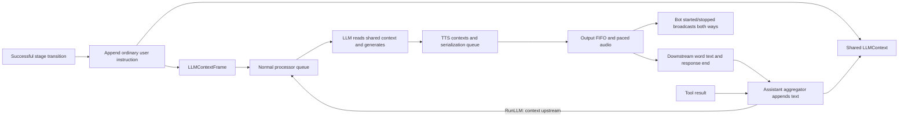

# TEC-5252: Pipecat state and frame alignment

Status: implemented locally on PR #43's `0b11bd7` head; awaiting review before commit/push. The shared-context baseline, processor metrics, and final frame/queue alignment were explicitly approved by Jaideep.

Reference: installed **Pipecat 0.0.108**, under `/Users/jaideepsingh/Projects/disha-backend/.venv/lib/python3.11/site-packages/pipecat`. This comparison uses its standard OpenAI service, universal aggregators, TTS service, and base output transport. Provider-specific Pipecat services can differ.

## What was removed

The published PR added response admission and generated-history coordination that Pipecat does not use. This revision removes it instead of moving or renaming it:

- Cross-pipeline `ResponseID` fields and `LLMMessagesAppendFrame.AfterResponseID`.
- User aggregator `pendingRuns`, `generatingResponseID`, `speakingResponseID`, pending-user text, and interruption acknowledgement state.
- The LLM processor's second request queue/worker and its separate generation cancellation gate.
- Generated assistant placeholders, `Message.pendingPlayback`, generated text on response-end, rollback, and completed-response markers.
- Delayed upstream bot-stop forwarding through the assistant aggregator.
- Per-response metric maps and attribution IDs, including per-context TTS metric collectors.
- The `played` flag that changed word/done frame priority, BaseProcessor input epochs, and the output suppression-until-next-start flag.

The injected instruction is unchanged and remains an ordinary user message:

```xml
<system_message>The system prompt has been updated for the next stage. Continue the conversation naturally using the new instructions, without repeating what you just said.</system_message>
```

## State that remains, and its actual counterpart

| Vago | Pipecat 0.0.108 counterpart | Purpose |
| --- | --- | --- |
| Shared `LLMContext`, carried by `LLMContextFrame` | `LLMContextFrame.context`; universal aggregator `push_context_frame` | Read the current shared context when the LLM queue consumes the request. Go snapshots under a mutex for memory safety, then performs any request-only enrichment. |
| `BaseProcessor.procCh`, processing context | `FrameProcessor.__process_queue`, processing task | Await inference on the normal processor loop. No separate LLM scheduler. |
| `BaseProcessor.procCurrent` | `FrameProcessor.__process_current_frame` and `_start_interruption` | Preserve an in-flight uninterruptible frame; otherwise cancel/recreate processing and retain only uninterruptible queued frames. |
| TTS `turn`, `contextsByID`, `outputQueue` | TTS `_turn_context_id`, `_audio_contexts`, `_serialization_queue` | Receive LLM text, collect independent provider contexts, and release context/frame output in FIFO order. |
| TTS `ContextID` on start, word, and stop frames | TTS `context_id` | Identify synthesis contexts. This is not an LLM response ID. |
| Playback queue and `playbackStarted` | Output sender audio queue and `_bot_speaking` | Pace output and originate both speaking notifications. |
| Assistant `functionCallsInProgress` | `_function_calls_in_progress` keyed by `tool_call_id` | Own tool context updates and native started/progress/result/cancel handling. |
| Processor timing collector | `FrameProcessorMetrics` processor/model timings | Best-effort timings without response correlation. |
| Per-frame `FrameMeta.ID` | `Frame.id` | Diagnostics for one frame instance, not response lifecycle coordination. |

The old Soniox `TranscriptFrame.ResponseID` and provider-native Responses API IDs are unrelated and remain. The Disha output filter's local response counter is only its existing log sequence, not the removed frame/context scheduling protocol.

## Flow



For standalone `TTSSpeakFrame`, TTS creates an independent context. Outside an active LLM response, it queues `LLMAssistantPushAggregationFrame` to flush that speech into context. Inside an active LLM response, the ordinary response-end remains the aggregation boundary. A new generation or cue never clears earlier output.

Interruption cancels processing and clears synthesis/output queues. Word frames are ordinary interruptible data before and after playback. There is no assistant-history acknowledgement, originating-response rejection, or special transcript-retention path.

## Accepted behavior changes

- `run_llm` does not wait for playback. The next inference may not see speech that has not reached assistant context.
- A late application classifier may still append and request inference after newer patient input. Disha's existing stage-name stale-result check remains; there is no response-origin guard.
- Explicit requests are not coalesced. Each tool result with `RunLLM=true` can request another inference, matching Pipecat's explicit result property.
- Replacement patient inference does not wait for assistant history. Text still queued downstream can be discarded on interruption.
- Pipecat resets its **processing** queue; it does not invalidate its separate input queue using epochs. Input frames not yet transferred can run after interruption.
- Metrics attached to a conversation chunk are the available processor timings at commit. Overlapping generation/synthesis no longer has guaranteed response-to-chunk attribution. Jaideep explicitly selected this behavior.

## Source map for review

All paths below are relative to the pinned Pipecat package:

| Concern | Pipecat source |
| --- | --- |
| Shared context and immediate append/run | `frames/frames.py::LLMContextFrame`, `LLMMessagesAppendFrame`; `processors/aggregators/llm_response_universal.py::push_context_frame`, `_handle_llm_messages_append` |
| Normal processor-loop inference | `services/openai/base_llm.py::process_frame` |
| Queue reset and current uninterruptible frame | `processors/frame_processor.py::_start_interruption`, `__reset_process_queue` |
| Tool context ownership | `processors/aggregators/llm_response_universal.py::_handle_function_calls_started`, `_handle_function_call_in_progress`, `_handle_function_call_result`, `_handle_function_call_cancel` |
| Tool broadcasts and cancellation | `services/llm_service.py::_run_function_call`, `_cancel_function_call` |
| Independent speech and aggregation flush | `services/tts_service.py::process_frame` (`TTSSpeakFrame` branch), `_serialization_task_handler` |
| Output-originated notifications | `transports/base_output.py::_bot_started_speaking`, `_bot_stopped_speaking` |
| Metrics state | `processors/metrics/frame_processor_metrics.py` |

## Remaining implementation differences

This is a Go adaptation of those contracts, not a complete port of every Pipecat service. `WordTimestampFrame` carries provider word text (Pipecat uses `TTSTextFrame`); `TTSDoneFrame` is the local name for TTS stop. Audio and words are interleaved at 20ms PCM boundaries rather than routed through Pipecat's general presentation-timestamp clock queue. Go uses bounded channels, mutexes, cooperative cancellation contexts, and its existing process-loop shutdown timeout. Cancellable tools use the processor cancellation context; non-cancellable tools use task lifetime, rather than asyncio task cancellation.

Existing Disha policies remain: stage selection/question/tool eligibility, Soniox turn detection, consecutive-user merging, persistence callbacks, a blocking business context enricher, empty-tool-result error reporting, and TTS reconnect/shutdown policy. No new compensating guard has been added for edge cases outside the pinned Pipecat behavior.

### Request-only enrichment correction after review

The first staged revision rewrote shared history with an enriched snapshot. Fable identified that a history append or tool-result update during retrieval could be overwritten. That write-back is removed: `LLMProcessor.SetMessagesEnricher` configures the existing application callback to enrich only a private outgoing copy, after the normal LLM queue consumes the shared context. The separate `ContextEnricherProcessor` is removed. User and assistant context ownership, frame contracts, and queue behavior stay the same; no context-update API, version counter, or retry is introduced.

Retrieval runs before LLM timing and response-start, retaining the separate `context_enricher/context_enrich` measurement and the existing fail-open behavior. Interruption uses the normal processor context and prevents an abandoned enrichment from reaching the provider. Tool-result runs pass through the same request-preparation step. Updates during retrieval remain in shared history for subsequent runs; the in-flight request keeps its snapshot. Pipecat's universal OpenAI service builds invocation parameters from the context through its adapter (`services/openai/base_llm.py::_stream_chat_completions_universal_context`); the protocol-retrieval callback is a Disha-specific extension at that boundary, not a native Pipecat hook.

## Validation

Tests cover shared context read at invocation; sequential generation; independently completed speech contexts with FIFO output; cues during LLM speech; ordinary word/end ordering; tool cancellation and non-cancellable results; late provider audio after cancellation; interruption process-queue reset; in-flight uninterruptible frames; graceful shutdown; and stage continuation eligibility, failed/stale transitions, and late classifier behavior.

Enrichment regression tests cover concurrent assistant/user appends and tool-result updates while retrieval is blocked, mutation confined to the outgoing copy, nil/empty-result fallback, cancellation before a provider request, queued context read at consumption, and enrichment on tool-result runs.

`go test ./...` and `go test -race ./voicepipelinecore ./disha -timeout 120s` passed after the runtime changes. The added standalone-speech integration test also passed under the race detector. `git diff --check` passed. No live call QA or deployment has been performed.

After the request-only enrichment correction, the targeted enrichment/queued-request/tool-loop tests passed under `-race`, followed by fresh successful runs of `go test ./...` and `go test -race ./voicepipelinecore ./disha -timeout 120s`.
